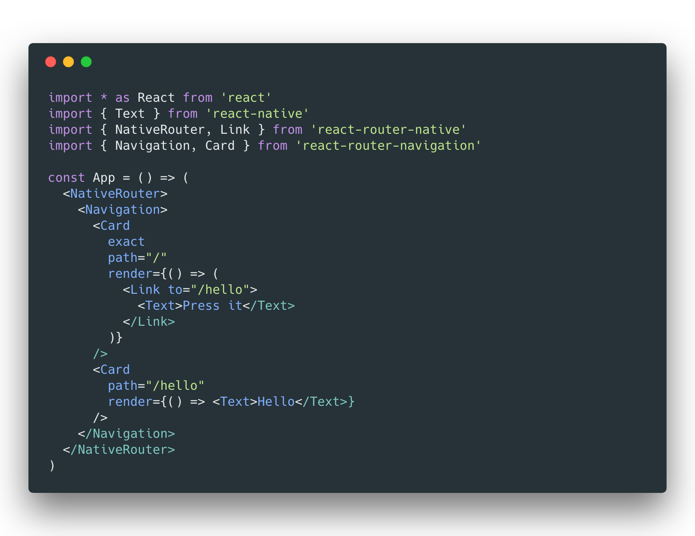

# react-router-navigation

[](https://travis-ci.org/winoteam/react-router-navigation)
[](https://badge.fury.io/js/react-router-navigation)
[](https://github.com/prettier/prettier)

> We are currently in the development phase of `v2`, which is published at npm under `develop` tag. **Latest stable version is `1.0.0-rc.4` and is published to npm under tag `latest`.**

**`react-router-navigation` provides tools to navigate between multiple screens with navigators or tab views. This library is based on `react-router`, `react-navigation`, and `react-native-tab-view`.**


## 🔥 Highlights

* **Just an add-on to [`react-router`](https://github.com/ReactTraining/react-router)**
* Declarative composability
* Allow you to call transitions anywhere in your code with simple components
* Dynamic Routing
* URL Driven Development
* Easy-to-use navigation solution using `react-navigation`
* Tab Bar Support using `react-native-tab-view`
* Cross-platform (iOS, Android and Web)
* First class deep linking support
* Nested Navigators
* [Fully-tested](https://facebook.github.io/jest/) & [strictly-typed](https://flow.org/)
* [TypeScript support](https://github.com/DefinitelyTyped/DefinitelyTyped/pull/23114)

## 📟  Demos
* [Minimal native app](examples/minimal-native-app)
* [Real world native app](examples/real-world-native-app)
* [Polaris web app](examples/polaris-web-app) ➡️ [See it !](https://focused-blackwell-61841d.netlify.com/)

## 💻  How to use

Install as project dependency:

```shell
$ yarn add react-router react-router-native react-router-navigation
```

Now you can use React Router Navigation to navigate between your screens:



## 💡 Guide

To learn how the library work, head to this introduction written by [@CharlesMangwa](https://twitter.com/Charles_Mangwa): [Thousand ways to navigate in React-Native](https://medium.com/the-react-native-log/thousand-ways-to-navigate-in-react-native-f7a1e311a0e8)

## 📖 Docs

* [`<Navigation />`](docs/NAVIGATION.md) handles the transition between different scenes in your app.
* [`<Tabs />`](docs/TABS.md) make it easy to explore and switch between different views.
* [`<BottomNavigation />`](docs/BOTTOM_NAVIGATION.md) make it easy to explore and switch between top-level views in a single tap.
* Works great with [React Native web](https://github.com/necolas/react-native-web). [Getting started](docs/REACT_NATIVE_WEB.md)
* And some [performance tips](docs/PERFORMANCE.md)

## 🕺 Contribute

**Want to hack on `react-router-navigation`? Awesome! We welcome contributions from anyone and everyone. :rocket:**

1. Fork this repository to your own GitHub account and then clone it to your local device
2. Install dependencies using Yarn: `yarn`
3. Ensure that the tests are passing using `yarn test`
4. Send a pull request 🙌

Remember to add tests for your change if possible.
️
## 👋 Questions

If you have any questions, feel free to get in touch on Twitter [@Leo_LeBras](https://twitter.com/Leo_LeBras) or open an issue.

## 😍 Thanks

`react-router-navigation` is based on [React Router](https://github.com/reactjs/react-router). Thanks to Ryan Florence [@ryanflorence](https://twitter.com/ryanflorence), Michael Jackson [@mjackson](https://twitter.com/mjackson) and all the contributors for their work on [`react-router`](https://github.com/reactjs/react-router) and [`history`](https://github.com/mjackson/history).

Special thanks to [@ericvicenti](https://twitter.com/ericvicenti), [@skevy](https://twitter.com/skevy), [@satya164](https://twitter.com/satya164) and [@grabbou](https://twitter.com/grabbou) for their work on [`react-navigation`](https://github.com/react-community/react-navigation/) and [@satya164](https://twitter.com/satya164) for his work on [`react-native-tab-view`](https://github.com/react-native-community/react-native-tab-view).
